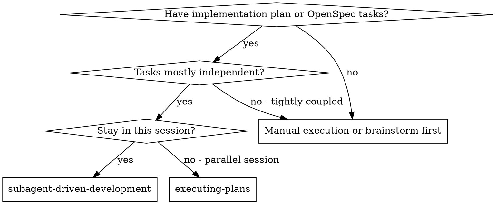
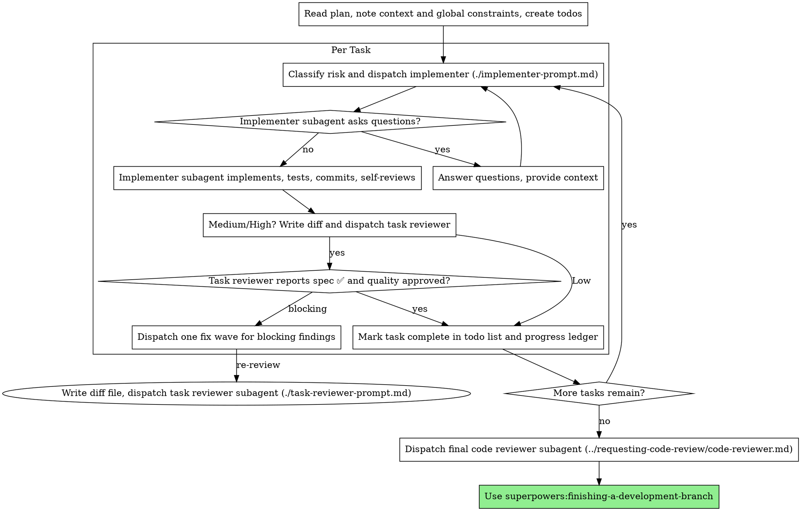

# Subagent-Driven Development

Execute a plan or OpenSpec change tasks by dispatching a fresh implementer per task, applying the risk-routed quality gate, and running one broad whole-branch review at the end.

**Why subagents:** You delegate tasks to specialized agents with isolated context. By precisely crafting their instructions and context, you ensure they stay focused and succeed at their task. They should never inherit your session's context or history — you construct exactly what they need. This also preserves your own context for coordination work.

**Core principle:** Match execution and review depth to observable change risk. Fresh task context, targeted automated evidence, and one final branch review protect quality; additional agents are added only when their judgment is needed. For OpenSpec work, `openspec/changes/<change-id>/tasks.md` is a valid implementation plan.

**Narration:** between tool calls, narrate at most one short line — the
ledger and the tool results carry the record.

**Continuous execution:** Do not pause to check in with your human partner between tasks. Execute all tasks from the plan without stopping. The only reasons to stop are: BLOCKED status you cannot resolve, ambiguity that genuinely prevents progress, or all tasks complete. "Should I continue?" prompts and progress summaries waste their time — they asked you to execute the plan, so execute it.

## When to Use



**vs. Executing Plans (parallel session):**
- Same session (no context switch)
- Fresh subagent per task (no context pollution)
- Risk-routed review per task, broad review at the end
- Faster iteration (no human-in-loop between tasks)

## Plan Sources

This skill can execute either:

- A written implementation plan under project docs.
- An OpenSpec tasks artifact from `openspec/changes/<change-id>/tasks.md` or the path returned by `openspec instructions apply --change "<change-id>" --json`.

For OpenSpec work:

- Treat proposal, design, specs, and tasks as the binding requirements.
- Copy exact OpenSpec requirements and scenarios into reviewer constraints when relevant.
- Mark OpenSpec task checkboxes only after implementation and its required risk route are approved.
- Finish through `openspec-apply-change` and `session-report`; this skill does not replace OpenSpec status/progress reporting.

## Risk Routing — Single Source of Truth

This skill owns the worker, reviewer, architect, model, and re-review route for every implementation task. A phase coordinator supplies phase gates and requirements but MUST NOT add a competing per-task review or architecture route.

Classify each task before dispatching. Use the highest applicable level.

| Risk | Observable criteria | Route |
|---|---|---|
| **Low** | Exact accepted spec; isolated mechanical change in 1–2 files; no public contract, schema, auth, concurrency, or new boundary; a focused automated test can prove it. | Targeted tests and self-review, then commit. Use `fast-worker` when isolation is useful; an exact micro-edit already inside an active cluster may be made directly by the controller. No task reviewer. |
| **Medium** | Multi-file integration, non-trivial business logic, debugging, incomplete local context, or behavior spanning a component boundary; no high-risk criterion. | `worker` profile, targeted tests and self-review, then `reviewer`. Blocking Critical/Important findings are fixed and re-reviewed. |
| **High** | Database schema or migration; public API/event/CLI contract; authentication/authorization; concurrency; irreversible external effect; new module/boundary; security-sensitive code; or a design decision costly to reverse. | `architect` before implementation; `worker`; targeted integration, contract, or security evidence; `reviewer`. Re-review blocking Critical/Important findings. Re-consult the architect only if implementation changes the approved design. |

The final whole-branch review runs once after all tasks. Use `worker` for an all-low branch, `reviewer` for medium, and `architect` for high. Do not run a broad review after every task.

### Operating Constraints

- State the risk classification and the criterion that selected it in the task ledger before dispatching.
- Dispatch the named custom-agent profile. If the current surface cannot select profiles, state that limitation and use the parent model without claiming profile-level model routing occurred.
- A reviewer consumes the implementer’s targeted test evidence and does not re-run the same tests without a concrete new risk.
- Use an architect only for High criteria, not because a task merely feels important or has several files.
- Keep task briefs narrow: the task, touched interfaces, binding constraints, acceptance evidence, and unresolved decisions. Hand artifacts over as files, not pasted session history.
- Do not start multiple writing workers in the same worktree. Parallelize only independent read-only exploration, test triage, or review work with separate inputs.
- Do not add unrelated refactoring, full audits, documentation, or dependency changes unless the task’s acceptance criteria require them.
- If a Low task exposes a contract, data, security, concurrency, or design concern, stop and reclassify it before changing scope.

### Decision Sufficiency Gate and Fast Lane

Before adding an analyst/explorer or architect, inspect the accepted OpenSpec/plan and the cluster brief. **Dispatch the worker immediately** when they already state: the goal and non-goals; affected boundaries and inputs/outputs; binding invariants; acceptance evidence; and the accepted decision for any consequential choice. Do not seek a second opinion merely because one could be obtained.

- Use one analyst/explorer only for a missing, verifiable fact that blocks implementation and cannot be obtained by the worker's normal focused reading. Its brief must ask one factual question, define the expected report artifact, and forbid new design, implementation, tests, or broad audits.
- Use an architect only for a new costly-to-reverse decision: public API/schema, authorization/security boundary, migration or irreversible effect, conflict between accepted requirements, or a choice that governs multiple later clusters. A pre-accepted OpenSpec design is not a reason to re-run architecture.
- **Spec-complete fast lane:** for pre-designed documentation, process scripts, wiring, and similar execution work with no High criterion, use one `worker` (Terra/medium) for the coherent cluster. Do not dispatch analyst/explorer or architect. Keep per-task focused evidence; review the cluster only when it crosses a real Medium integration boundary. Low-only clusters use self-review and the final branch review.
- `fast-worker` is optional, not a ceremony. Use it for an isolated mechanical task when fresh context or cheap independent execution helps. If the edit is an exact small part of the active cluster, the controller may make it directly and include its focused evidence in the cluster report; do not pay for a separate subagent just to change a line.

### Review Freeze and Bounded Loops

A task review is a verdict on one immutable implementation snapshot, not a background activity to overlap with more changes.

- Before dispatching a Medium or High reviewer, complete a **pre-review gate**: the task acceptance checklist is covered, focused tests are green, the implementer report is complete, the task commits are recorded, and the worktree is clean. Generate the review package from that exact `BASE..HEAD` range and record both SHAs in the ledger.
- Once the reviewer is dispatched, **freeze the task worktree**. Do not edit code, tests, task documentation, status files, commits, or the review package until its verdict arrives. Read-only exploration is allowed only if it cannot alter the reviewed task or its inputs.
- A new idea found while review is running is a Follow-up. Record it; do not add a test or "small improvement" to the frozen diff. The only exception is concrete evidence of an active security, data-integrity, or contract regression. Cancel the review, record the evidence, reclassify the task if needed, and create a new snapshot after the fix.
- Accept a review only when its `HEAD` and clean worktree match the recorded snapshot. Any change during review invalidates the verdict; do not treat an approval of an older diff as approval of the current one.
- Normal route is **one initial review, one consolidated Blocking fix wave, and one re-review**. Do not create per-finding fixers or review after each tweak. A further loop is allowed only when the re-review proves a new Critical/Important regression introduced by the fix; it must state that new evidence and remain narrowly scoped. Contract or threat-model changes use change-intake/architecture, not an unbounded third loop.

### Autonomous Stall Circuit Breaker

Keep executing the phase autonomously, but do not wait indefinitely for an agent or tool.

- Define the first expected artifact in every dispatch: a read-only report, a diff, focused-test result, or a concrete blocker.
- If two bounded waits pass without that artifact or a meaningful status, interrupt the stalled subagent. Do not keep polling and do not blindly re-dispatch the same broad task.
- Inspect the worktree first. Preserve and use a valid partial diff; otherwise continue locally or dispatch one narrower replacement with non-overlapping scope. Record the stall once in the ledger.
- Tool/ACL/patcher failures and broken test fixtures are process incidents, not product findings. Repair the narrow incident, rerun the affected check, and do not widen the task, review scope, or documentation work because of it.

### Progress and Routing Evidence

Keep reporting durable but sparse. For every cluster, write one compact entry in the progress ledger at dispatch, at any circuit-breaker event, and at completion — never a status message after every tool call. The entry records:

- included task IDs, selected profile/direct-controller route, and the concrete routing reason;
- dispatch timestamp, first artifact timestamp, completion timestamp, and any observed wait/stall interval;
- analyst/architect decision: used or skipped, with the Decision Sufficiency Gate evidence;
- focused tests/evidence per atomic task, review verdict when required, and any follow-up or scope decision.

Each dispatch declares its first expected artifact and a proportional checkpoint: normally a factual report within 15 minutes or a first implementation artifact within 30 minutes. If the checkpoint passes without an artifact or meaningful status, apply the Autonomous Stall Circuit Breaker. Record observed durations; never invent estimates of model "thinking time".

### Scope Firewall

The accepted task contract is its brief, binding global constraints, accepted architecture decision, and stated acceptance evidence. A review blocks the task only for a defect that demonstrably violates one of those items or creates a concrete regression/security/data-integrity risk in the changed code.

- Every blocking Critical or Important finding MUST name the violated contract/invariant and cite diff evidence. It enters one consolidated fix wave and then re-review.
- A useful hardening idea, broader coverage, adjacent refactor, or new edge case outside that contract is a **Follow-up**, not a blocker. Record it in the ledger or route it through `phase-change-intake`; do not reopen the current task for it.
- If fixing a genuine blocker changes the accepted contract, threat model, or task boundary, stop the review loop. Create a change-intake/architecture decision, update the task scope, then resume with one new bounded implementation route. Do not smuggle a redesign into repeated fix waves.
- Run an architecture gate once for the accepted High-risk contract. Re-run it only when the contract or threat model changes, never solely because a reviewer proposes additional hardening.

## Clustered Execution and Review Units

OpenSpec tasks remain atomic acceptance and status units. They are not automatically separate implementation or review units. Before dispatching the next task, scan all remaining unchecked tasks and create a short cluster map in the progress ledger.

Create one **review cluster** only when all of its tasks:

- implement one coherent component, interface, or end-to-end flow;
- share an accepted architecture and do not require a new human decision between them;
- can be implemented sequentially by one writing worker in one worktree;
- have per-task acceptance evidence that can be named separately; and
- produce one bounded, intelligible diff that a reviewer can judge as a whole.

Adjacent numbering alone is not enough. Do not cluster unrelated work merely to avoid review. Split a cluster at a public-contract/schema/auth/security boundary, a dependency needing acceptance, a task with a different risk route, or when the combined diff is no longer reviewable in one focused pass.

For a valid cluster:

1. Write a cluster brief listing the included task IDs, each task's exact acceptance evidence, shared interfaces, and the cluster exit test set. Do not paste broad session history or rediscover already accepted analysis.
2. One worker executes the tasks sequentially, recording focused evidence against each atomic task. Do not dispatch an explorer merely to restate the accepted plan.
3. Freeze and review the **cluster snapshot once**: Low-only clusters use focused evidence and self-review; Medium/High clusters use one task reviewer after the final included task. The reviewer must assess every listed task's acceptance matrix, but receives one diff package.
4. One Blocking fix wave covers all cluster findings, then one re-review of the cluster. Mark each OpenSpec checkbox only when its own evidence is complete; commit at the cluster boundary unless a project rule requires an earlier commit.
5. A finding or blocker that changes the cluster contract splits it at that boundary and goes through change-intake/architecture. Do not silently turn a cluster into an unbounded mini-phase.

Use clusters to remove duplicated setup and review, not to lower evidence. A coherent dispatcher group such as 3.1–3.4 is normally one cluster if it satisfies the conditions above.

## The Process



## Pre-Flight Plan Review

Before dispatching Task 1, scan the plan once for conflicts:

- tasks that contradict each other or the plan's Global Constraints
- anything the plan explicitly mandates that the review rubric treats as a
  defect (a test that asserts nothing, verbatim duplication of a logic block)

Present everything you find to your human partner as one batched question —
each finding beside the plan text that mandates it, asking which governs —
before execution begins, not one interrupt per discovery mid-plan. If the
scan is clean, proceed without comment. The review loop remains the net for
conflicts that only emerge from implementation.

## Model Selection

Use the least powerful model that can handle each role to conserve cost and increase speed.

**Mechanical implementation tasks** (isolated functions, clear specs, 1-2 files): use `fast-worker`. These are Low tasks and use the Low route above.

**Integration and judgment tasks** (multi-file coordination, pattern matching, debugging): use `worker`. These are Medium unless a High criterion applies.

**Architecture and design tasks**: use `architect`. They are High tasks. The final whole-branch review follows the branch-risk rule above rather than automatically using the most capable model.

**Review tasks**: choose the model with the same judgment, scaled to the diff's size, complexity, and risk. Low tasks do not get a separate task reviewer; a small mechanical diff is protected by its focused test and final branch review.

**Always dispatch the named custom-agent profile when the surface supports it.** If it cannot select profiles, the child inherits the parent model; state that fallback plainly and do not claim profile-level routing occurred.

**Turn count beats token price.** Wall-clock and context cost scale with how
many turns a subagent takes, and the cheapest models routinely take 2-3× the
turns on multi-step work — costing more overall. Use a mid-tier model as the
floor for reviewers and for implementers working from prose descriptions.
When the task's plan text contains the complete code to write, the
implementation is transcription plus testing: use the cheapest tier for
that implementer. Single-file mechanical fixes also take the cheapest tier.

**Task complexity signals (implementation tasks):**
- Touches 1-2 files with a complete spec and no High criterion → Low / cheap model
- Touches multiple files with integration concerns → Medium / standard model
- Requires a High criterion or broad design judgment → High / most capable model

## Handling Implementer Status

Implementer subagents report one of four statuses. Handle each appropriately:

**DONE:** Generate the review package (`scripts/review-package BASE HEAD`, from this skill's directory — it prints the unique file path it wrote; BASE is the commit you recorded before dispatching the implementer — never `HEAD~1`, which silently drops all but the last commit of a multi-commit task), then dispatch the task reviewer with the printed path.

**DONE_WITH_CONCERNS:** The implementer completed the work but flagged doubts. Read the concerns before proceeding. If the concerns are about correctness or scope, address them before review. If they're observations (e.g., "this file is getting large"), note them and proceed to review.

**NEEDS_CONTEXT:** The implementer needs information that wasn't provided. Provide the missing context and re-dispatch.

**BLOCKED:** The implementer cannot complete the task. Assess the blocker:
1. If it's a context problem, provide more context and re-dispatch with the same model
2. If the task requires more reasoning, re-dispatch with a more capable model
3. If the task is too large, break it into smaller pieces
4. If the plan itself is wrong, escalate to the human

**Never** ignore an escalation or force the same model to retry without changes. If the implementer said it's stuck, something needs to change.

## Handling Reviewer ⚠️ Items

The task reviewer may report "⚠️ Cannot verify from diff" items — requirements
that live in unchanged code or span tasks. These do not block the rest of the
review, but you must resolve each one yourself before marking the task
complete: you hold the plan and cross-task context the reviewer
lacks. If you confirm an item is a real gap, treat it as a failed spec
review — send it back to the implementer and re-review.

## Handling Review Scope

Before dispatching a fix, classify every finding as **Blocking** or **Follow-up** using the Scope Firewall. A reviewer severity alone does not override this classification: a claimed Important finding without a violated contract/invariant and diff evidence is a Follow-up. Do not suppress it; record it with its rationale for the final review or `phase-change-intake`.

## Constructing Reviewer Prompts

Per-task reviews are task-scoped gates for Medium and High tasks. The broad review happens once, at the final whole-branch review. When you fill a reviewer template:

- Do not add open-ended directives like "check all uses" or "run race tests
  if useful" without a concrete, task-specific reason
- Do not ask a reviewer to re-run tests the implementer already ran on the
  same code — the implementer's report carries the test evidence
- Do not pre-judge findings for the reviewer — never instruct a reviewer to
  ignore or not flag a specific issue. If you believe a finding would be a
  false positive, let the reviewer raise it and adjudicate it in the review
  loop. If the prompt you are writing contains "do not flag," "don't treat X
  as a defect," "at most Minor," or "the plan chose" — stop: you are
  pre-judging, usually to spare yourself a review loop.
- The global-constraints block you hand the reviewer is its attention
  lens. Copy the binding requirements verbatim from the plan's Global
  Constraints section or the spec: exact values, exact formats, and the
  stated relationships between components ("same layout as X", "matches
  Y"). The reviewer's template already carries the process rules (YAGNI,
  test hygiene, review method) — the constraints block is for what THIS
  project's spec demands.
- Hand the reviewer its diff as a file: run this skill's
  `scripts/review-package BASE HEAD` and pass the reviewer the file path
  it prints (or, without bash: `git log --oneline`, `git diff --stat`,
  and `git diff -U10` for the range, redirected to one uniquely named
  file). The output never enters your own context, and the reviewer sees
  the commit list, stat summary, and full diff with context in one Read
  call. Use the BASE you recorded before dispatching the implementer —
  never `HEAD~1`, which silently truncates multi-commit tasks.
- A dispatch prompt describes one task, not the session's history. Do not
  paste accumulated prior-task summaries ("state after Tasks 1-3") into
  later dispatches — a real session's dispatch hit 42k chars of which 99%
  was pasted history. A fresh subagent needs its task, the interfaces it
  touches, and the global constraints. Nothing else.
- Dispatch one fix subagent for the complete set of Blocking Critical and
  Important findings. Record Follow-ups in the progress ledger as you go,
  and point the final whole-branch review at that list so it can triage
  whether changed branch scope makes any of them blocking. A roll-up nobody
  reads is a silent discard.
- A finding labeled plan-mandated — or any finding that conflicts with
  what the plan's text requires — is the human's decision, like any plan
  contradiction: present the finding and the plan text, ask which governs.
  Do not dismiss the finding because the plan mandates it, and do not
  dispatch a fix that contradicts the plan without asking.
- The final whole-branch review gets a package too: run
  `scripts/review-package MERGE_BASE HEAD` (MERGE_BASE = the commit the
  branch started from, e.g. `git merge-base main HEAD`) and include the
  printed path in the final review dispatch, so the final reviewer reads
  one file instead of re-deriving the branch diff with git commands.
- Every fix dispatch carries the implementer contract: the fix subagent
  re-runs the tests covering its change and reports the results. Name the
  covering test files in the dispatch — a one-line fix does not need the
  whole suite. Before re-dispatching the reviewer, confirm the fix report
  contains the covering tests, the command run, and the output; dispatch
  the re-review once all three are present.
- If the final whole-branch review returns findings, dispatch ONE fix
  subagent with the complete findings list — not one fixer per finding.
  Per-finding fixers each rebuild context and re-run suites; a real
  session's final-review fix wave cost more than all its tasks combined.

## File Handoffs

Everything you paste into a dispatch prompt — and everything a subagent
prints back — stays resident in your context for the rest of the session
and is re-read on every later turn. Hand artifacts over as files:

- **Task brief:** before dispatching an implementer, run this skill's
  `scripts/task-brief PLAN_FILE N` — it extracts the task's full text to a
  uniquely named file and prints the path. Compose the dispatch so the
  brief stays the single source of requirements. Your dispatch should
  contain: (1) one line on where this task fits in the project; (2) the
  brief path, introduced as "read this first — it is your requirements,
  with the exact values to use verbatim"; (3) interfaces and decisions
  from earlier tasks that the brief cannot know; (4) your resolution of
  any ambiguity you noticed in the brief; (5) the report-file path and
  report contract. Exact values (numbers, magic strings, signatures, test
  cases) appear only in the brief.
- **Report file:** name the implementer's report file after the brief
  (brief `…/task-N-brief.md` → report `…/task-N-report.md`) and put it in
  the dispatch prompt. The implementer writes the full report there and
  returns only status, commits, a one-line test summary, and concerns.
- **Reviewer inputs:** the task reviewer gets three paths — the same brief
  file, the report file, and the review package — plus the global
  constraints that bind the task.
- Fix dispatches append their fix report (with test results) to the same
  report file and return a short summary; re-reviews read the updated file.

## Durable Progress

Conversation memory does not survive compaction. In real sessions,
controllers that lost their place have re-dispatched entire completed task
sequences — the single most expensive failure observed. Track progress in
a ledger file, not only in todos.

- At skill start, check for a ledger:
  `cat "$(git rev-parse --show-toplevel)/.superpowers/sdd/progress.md"`. Tasks listed there
  as complete are DONE — do not re-dispatch them; resume at the first task
  not marked complete.
- When a task's route is complete, append one line to the ledger in
  the same message as your other bookkeeping:
  `Task N: complete (commits <base7>..<head7>, review clean)`.
- The ledger is your recovery map: the commits it names exist in git even
  when your context no longer remembers creating them. After compaction,
  trust the ledger and `git log` over your own recollection.
- `git clean -fdx` will destroy the ledger (it's git-ignored scratch); if
  that happens, recover from `git log`.

## Prompt Templates

- [implementer-prompt.md](implementer-prompt.md) - Dispatch implementer subagent
- [task-reviewer-prompt.md](task-reviewer-prompt.md) - Dispatch task reviewer subagent (spec compliance + code quality)
- Final whole-branch review: use superpowers:requesting-code-review's [code-reviewer.md](../requesting-code-review/code-reviewer.md)

## Example Workflow

```
You: I'm using Subagent-Driven Development to execute this plan.

[Read plan file once: docs/superpowers/plans/feature-plan.md]
[Create todos for all tasks]

Task 1: Hook installation script

[Run task-brief for Task 1; dispatch implementer with brief + report paths + context]

Implementer: "Before I begin - should the hook be installed at user or system level?"

You: "User level (~/.config/superpowers/hooks/)"

Implementer: "Got it. Implementing now..."
[Later] Implementer:
  - Implemented install-hook command
  - Added tests, 5/5 passing
  - Self-review: Found I missed --force flag, added it
  - Committed

[Run review-package, dispatch task reviewer with the printed path]
Task reviewer: Spec ✅ - all requirements met, nothing extra.
  Strengths: Good test coverage, clean. Issues: None. Task quality: Approved.

[Mark Task 1 complete]

Task 2: Recovery modes

[Run task-brief for Task 2; dispatch implementer with brief + report paths + context]

Implementer: [No questions, proceeds]
Implementer:
  - Added verify/repair modes
  - 8/8 tests passing
  - Self-review: All good
  - Committed

[Run review-package, dispatch task reviewer with the printed path]
Task reviewer: Spec ❌:
  - Missing: Progress reporting (spec says "report every 100 items")
  - Extra: Added --json flag (not requested)
  Issues (Important): Magic number (100)

[Dispatch fix subagent with all findings]
Fixer: Removed --json flag, added progress reporting, extracted PROGRESS_INTERVAL constant

[Task reviewer reviews again]
Task reviewer: Spec ✅. Task quality: Approved.

[Mark Task 2 complete]

...

[After all tasks]
[Dispatch final code-reviewer]
Final reviewer: All requirements met, ready to merge

Done!
```

## Advantages

**vs. Manual execution:**
- Subagents follow TDD naturally
- Fresh context per task (no confusion)
- Parallel-safe (subagents don't interfere)
- Subagent can ask questions (before AND during work)

**vs. Executing Plans:**
- Same session (no handoff)
- Continuous progress (no waiting)
- Review checkpoints automatic

**Efficiency gains:**
- Controller curates exactly what context is needed; bulk artifacts move
  as files, not pasted text
- Subagent gets complete information upfront
- Questions surfaced before work begins (not after)

**Quality gates:**
- Low: focused automated evidence and self-review
- Medium: focused evidence, self-review, task review, and review loops
- High: architecture decision, focused evidence, task review, and review loops
- All branches: one final whole-branch review

**Cost:**
- Low tasks use one worker; Medium and High add only the judgment their risk requires
- Controller does more prep work (extracting all tasks upfront)
- Review loops add iterations only when a Medium or High reviewer finds Blocking Critical/Important issues
- Targeted evidence catches issues early without re-running broad checks per task

## Red Flags

**Never:**
- Start implementation on main/master branch without explicit user consent
- Skip a task review required by its Medium or High route, or accept a report missing either verdict (spec compliance AND task quality are both required)
- Proceed with unresolved Blocking issues
- Dispatch multiple implementation subagents in parallel (conflicts)
- Make a subagent read the whole plan file (hand it its task brief —
  `scripts/task-brief` — instead)
- Skip scene-setting context (subagent needs to understand where task fits)
- Ignore subagent questions (answer before letting them proceed)
- Accept "close enough" on spec compliance (reviewer found spec issues = not done)
- Skip review loops for Blocking issues (blocking reviewer finding = one consolidated fix wave = re-review)
- Let implementer self-review replace the task review required for a Medium or High task
- Tell a reviewer what not to flag, or pre-rate a finding's severity in the
  dispatch prompt ("treat it as Minor at most") — the plan's example code is
  a starting point, not evidence that its weaknesses were chosen
- Dispatch a task reviewer without a diff file — generate it first
  (`scripts/review-package BASE HEAD`) and name the printed path in the
  prompt
- Move to next task while the review has open Critical/Important issues
- Re-dispatch a task the progress ledger already marks complete — check
  the ledger (and `git log`) after any compaction or resume

**If subagent asks questions:**
- Answer clearly and completely
- Provide additional context if needed
- Don't rush them into implementation

**If reviewer finds issues:**
- Classify each as Blocking or Follow-up under the Scope Firewall
- One implementer fixes the complete Blocking set; Follow-ups go to the ledger/change-intake
- Reviewer re-reviews the blocking diff once the fix evidence is complete
- If the fix changes contract or threat model, stop for a bounded architecture decision instead of iterating a redesign

**While reviewer is running:**
- Keep the reviewed task frozen; never "use the waiting time" to change its code, tests, documentation, or acceptance criteria.
- Record extra ideas as Follow-ups. Cancel and restart a review only for concrete active security, data-integrity, or contract-regression evidence.

**If subagent fails task:**
- Dispatch fix subagent with specific instructions
- Don't try to fix manually (context pollution)

## Integration

**Required workflow skills:**
- **superpowers:using-git-worktrees** - Ensures isolated workspace (creates one or verifies existing)
- **superpowers:writing-plans** - Creates the plan this skill executes
- **openspec-apply-change** - Provides OpenSpec change status, context files, tasks, verification, and final reporting when the plan source is an OpenSpec change
- **superpowers:requesting-code-review** - Code review template for the final whole-branch review
- **superpowers:finishing-a-development-branch** - Complete development after all tasks

**Subagents should use:**
- **superpowers:test-driven-development** - Subagents follow TDD for each task

**Alternative workflow:**
- **superpowers:executing-plans** - Use for parallel session instead of same-session execution
